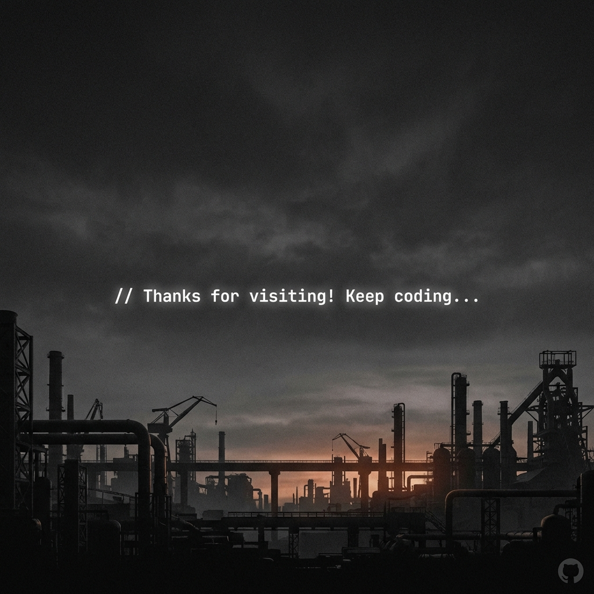

<!-- Hero Banner -->
<p align="center">
  
</p>

<h1 align="center">
  
</h1>

<p align="center">
  <a href="mailto:shahrukhkhann@outlook.com"></a>
  <a href="https://linkedin.com/in/shahrukhkhann"></a>
  <a href="https://github.com/codebysrk"></a>
  <a href="https://twitter.com/maishahrukh"></a>
</p>

<p align="center">
  
  
</p>

---

<!-- Section Divider -->


## 🧑‍💻 About Me

```terminal
┌──────────────────────────────────────────────────────────────────────┐
│  > whoami                                                            │
│                                                                      │
│  Full Stack Developer | AI/ML Enthusiast | Open Source Contributor   │
│                                                                      │
│  > cat current_status.txt                                            │
│                                                                      │
│  🔭 Currently working on: Web Development & AI/ML Projects           │
│  🌱 Learning: Deep Learning, Cloud Architecture, System Design       │
│  💬 Ask me about: JavaScript, Python, React, Node.js, AI/ML          │
│  ⚡ Fun fact: I code at night and debug during the day               │
│                                                                      │
└──────────────────────────────────────────────────────────────────────┘
```

- 🎯 I'm passionate about building **scalable applications** and **intelligent systems**
- 🤝 Open to collaborate on **innovative projects** and **open source contributions**
- 📫 Reach me at: **shahrukhkhann@outlook.com**

---

<!-- Section Divider -->


## 🛠️ Tech Stack

### Languages

<p align="left">
  
  
  
  
  
  
  
</p>

### Frontend

<p align="left">
  
  
  
  
  
  
</p>

### Backend & Database

<p align="left">
  
  
  
  
  
  
  
</p>

### AI/ML & Data Science

<p align="left">
  
  
  
  
  
  
</p>

### DevOps & Tools

<p align="left">
  
  
  
  
  
  
</p>

---

<!-- Section Divider -->


## 📊 GitHub Stats

<p align="center">
  
  
</p>

<p align="center">
  
</p>

<p align="center">
  
</p>

---

<!-- Section Divider -->


## 🏆 GitHub Trophies

<p align="center">
  
</p>

---

<!-- Section Divider -->


## 🐍 Contribution Graph

<picture>
  <source media="(prefers-color-scheme: dark)" srcset="https://raw.githubusercontent.com/codebysrk/codebysrk/output/github-contribution-grid-snake-dark.svg">
  <source media="(prefers-color-scheme: light)" srcset="https://raw.githubusercontent.com/codebysrk/codebysrk/output/github-contribution-grid-snake.svg">
  
</picture>

---

<!-- Section Divider -->


## 📫 Connect With Me

<p align="center">
  <a href="https://github.com/codebysrk" target="_blank">
    
  </a>
  <a href="https://linkedin.com/in/shahrukhkhann" target="_blank">
    
  </a>
  <a href="mailto:shahrukhkhann@outlook.com">
    
  </a>
  <a href="https://twitter.com/maishahrukh" target="_blank">
    
  </a>
  <a href="https://instagram.com/maishahrukh" target="_blank">
    
  </a>
</p>

---

<!-- Section Divider -->


## ☕ Support Me

<p align="center">
  <a href="https://www.buymeacoffee.com/codebysrk" target="_blank">
    
  </a>
</p>

---

<!-- Footer -->
<p align="center">
  
</p>

<p align="center">
  <b>⭐ Star my repositories if you find them useful! ⭐</b>
</p>

<p align="center">
  Made with ❤️ by <a href="https://github.com/codebysrk">SRK</a>
</p>
