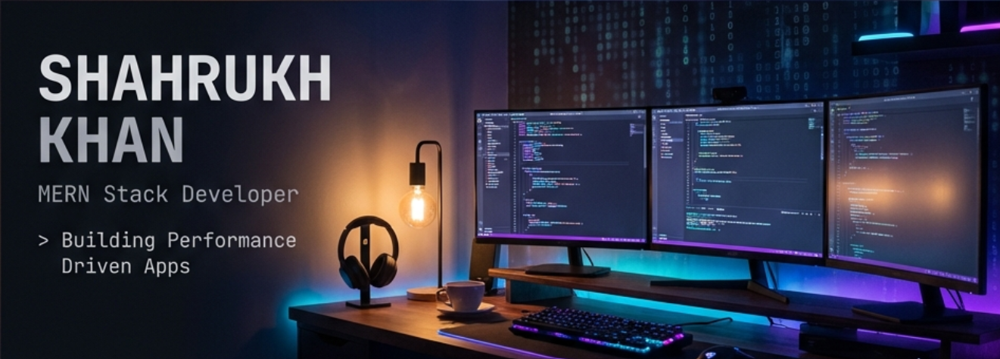

<!-- Top Waving Banner -->
<p align="center">
  
</p>

<!-- Hero Banner -->
<p align="center">
  
</p>

<h1 align="center">
  
</h1>

<p align="center">
  <a href="mailto:shahrukhkhann@outlook.in">
    
  </a>&nbsp;
  <a href="https://linkedin.com/in/shahrukhkhann">
    
  </a>&nbsp;
  <a href="https://github.com/codebysrk">
    
  </a>
</p>

<p align="center">
  
  &nbsp;&nbsp;
  
</p>


## 👨‍💻 About Me

> _"My passion lies in building robust, user-friendly, and performance-driven solutions."_

```javascript
const shahrukh = {
  role: "MERN Stack Developer",
  location: "Ambah, Madhya Pradesh, India 🇮🇳",

  education: {
    masters: "MCA - MITS, Gwalior (2024)",
    bachelors: "B.Sc - Jiwaji University (2022)",
  },

  experience: [
    "Student @ Sheryians Coding School",
    "Ex-Web Developer @ Praedico Global Research",
  ],

  technicalSkills: [
    "MERN Stack (MongoDB, Express, React, Node)",
    "RESTful APIs",
    "Cloudinary",
    "Swiper.js",
  ],

  certifications: ["Blockchain", "Cloud Computing"],
};
```


## 🛠️ Tech Stack

<table align="center">
<tr>
<td valign="top" width="33%">

### 💻 Frontend

<p align="center">
  
</p>

</td>
<td valign="top" width="33%">

### ⚙️ Backend & DB

<p align="center">
  
</p>

</td>
<td valign="top" width="33%">

### 🔧 Tools & Libraries

<p align="center">
  
</p>
<p align="center">
  
  
</p>

</td>
</tr>
</table>


## 📊 GitHub Stats

<p align="center">
  
  &nbsp;
  
</p>

<p align="center">
  
</p>


## 🏆 GitHub Trophies

<p align="center">
  
</p>


## 📈 Contribution Graph

<p align="center">
  
</p>


## 🐍 Contribution Snake

<p align="center">
  <picture>
    <source media="(prefers-color-scheme: dark)" srcset="https://raw.githubusercontent.com/codebysrk/codebysrk/output/github-contribution-grid-snake-dark.svg">
    <source media="(prefers-color-scheme: light)" srcset="https://raw.githubusercontent.com/codebysrk/codebysrk/output/github-contribution-grid-snake.svg">
    
  </picture>
</p>


## 🤝 Let's Connect

<p align="center">
  <i>Open to opportunities and collaborations!</i>
</p>

<p align="center">
  <a href="https://linkedin.com/in/shahrukhkhann">
    
  </a>&nbsp;
  <a href="mailto:shahrukhkhann@outlook.in">
    
  </a>&nbsp;
  <a href="https://github.com/codebysrk">
    
  </a>
</p>


<p align="center">
  
</p>

<p align="center">
  <b>⭐ If you find my work helpful, consider giving a star! ⭐</b>
</p>
